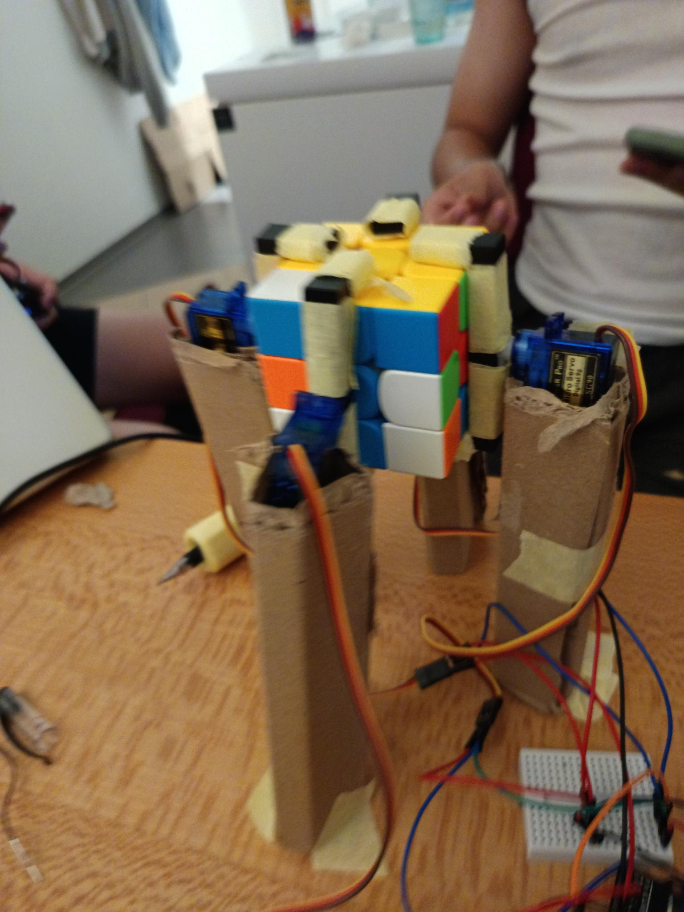
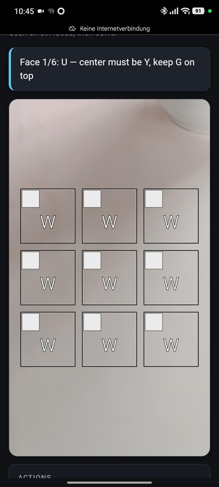
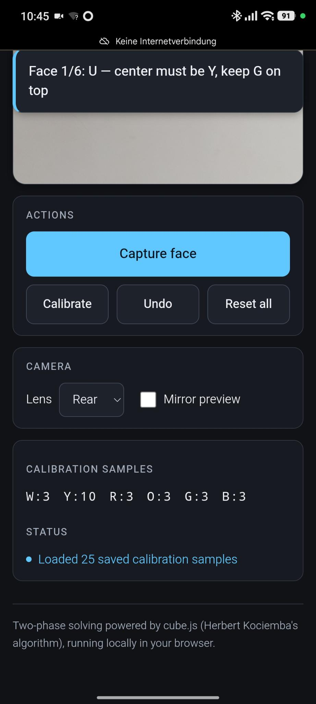

# Cubus

... an automated Rubix Cube solver

## How to use:

1. Plug it in
2. Connect with your non apple device to the wifi "Cubus-Setup" with the password "012345678"
3. use Chrome:

One Time setup:
4. open "chrome://flags/#unsafely-treat-insecure-origin-as-secure"
5. in the box: "Insecure origins treated as secure" type    "http://cubus.local" and change to enabled
6. Save the settings

Normal:
7. open "http://cubus.local"
8. Kalibrate your cube, press the callibrate color a few times for every side
9. Scan your cube and press solve
10. Place your cube into the machine
11. hit "Send to Cubus robot" and watch the machine solve your cube

